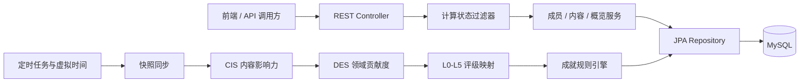

# 论坛成员评级与成就系统

基于 Spring Boot 的论坛数据分析后端。系统同步成员与内容快照，以 CIS/DES 两阶段算法计算内容影响力和成员领域贡献度，生成 L0–L5 评级，并提供成员、内容排行、系统概览和成就查询 API。

## 核心能力

- **两阶段评级**：先计算内容影响分（CIS），再结合成员行为与时间衰减计算综合分（DES）。
- **虚拟时间**：支持 288× 加速，虚拟时间每 30 秒推进 1 天，用于验证定时评级链路。
- **批量数据处理**：验证数据集包含 2,000 名成员和 45,717 条内容快照。
- **成就规则引擎**：规则实现统一接口，可扩展首帖、领域专家、稳定创作者等成就。
- **分层后端结构**：Controller、Service、Repository、DTO、Entity 职责分离。
- **自动化测试**：包含评级算法与服务层单元测试，以及 8 个端到端集成测试。

## 系统架构



评级计算由定时任务触发，并以计算状态过滤器控制计算期间的查询行为；Controller、Service、Repository、DTO 和 Entity 分层，避免算法、持久化与接口表示相互耦合。

## 技术栈

- Java 17
- Spring Boot 3.5.7
- Spring Web / Spring Data JPA
- MySQL 8
- Maven
- JUnit 5 / Spring Boot Test

## 目录结构

```text
rating-backend/
├── docs/
│   └── createdb.sql
├── src/main/java/com/community/rating/
│   ├── achievement/     # 成就规则及规则接口
│   ├── config/          # Web 与过滤器配置
│   ├── controller/      # REST API
│   ├── dto/             # 数据传输对象
│   ├── entity/          # JPA 实体
│   ├── filter/          # 计算状态过滤
│   ├── repository/      # 数据访问
│   ├── service/         # 评级、成员、内容、成就与概览服务
│   └── util/            # 进度与状态工具
└── src/test/java/com/community/rating/
    ├── integration/     # 端到端集成测试
    └── service/         # 算法与服务层测试
```

## 快速开始

### 1. 初始化数据库

```powershell
Get-Content -LiteralPath 'rating-backend/docs/createdb.sql' -Raw -Encoding utf8 | mysql -u root -p
```

### 2. 配置连接

项目不保存数据库密码。PowerShell 示例：

```powershell
$env:DB_URL = 'jdbc:mysql://localhost:3306/ratingdb?useSSL=false&serverTimezone=Asia/Shanghai&allowPublicKeyRetrieval=true&rewriteBatchedStatements=true'
$env:DB_USERNAME = 'root'
$env:DB_PASSWORD = '<your-password>'
```

### 3. 启动后端

```powershell
Set-Location rating-backend
.\mvnw.cmd spring-boot:run
```

默认端口为 `8081`。

## API 概览

| 模块 | 示例端点 | 说明 |
| --- | --- | --- |
| 系统概览 | `GET /api/SystemOverview` | 用户数、内容数、评级分布与排行榜 |
| 成员排行 | `GET /api/Member/ranking` | 查询成员排行榜 |
| 成员详情 | `GET /api/Member/{member_id}` | 成员详情、评级和历史 |
| 成员搜索 | `GET /api/Member/search` | 按条件检索成员 |
| 内容 | `GET /api/Content/getContentRanking` | 内容排行 |
| 内容搜索 | `GET /api/Content/searchContent` | 按条件检索内容 |
| 评级 | `GET /api/v1/ratings/member/{memberId}` | 查询成员评级 |
| 领域评级 | `GET /api/v1/ratings/area/{areaId}` | 查询领域评级结果 |
| 成就 | `GET /api/Achievement/getAchievementList` | 查询成就列表 |
| 成就排行 | `GET /api/Achievement/getAchievementRanking` | 查询成就排行榜 |

实际参数和响应结构以 `controller/` 下的实现为准。

## 测试

```powershell
Set-Location rating-backend
.\mvnw.cmd test
```

集成测试覆盖：虚拟时间、成员同步、内容快照、完整评级流程、系统概览、评级分布、定时触发和成就记录。

## 设计要点

### CIS/DES 评级流程

1. 拉取成员与内容快照。
2. 计算内容影响分（CIS）。
3. 按知识领域聚合成员行为。
4. 结合时间衰减计算成员综合分（DES）。
5. 将得分映射为 L0–L5 六个等级并持久化。
6. 运行成就规则并写入新达成记录。

核心计算关系为：

```text
CIS = (BaseScore × QualityFactor × ShareBoost) - NegativePenalty
DES(K) = Σ(CIS_i × RecencyFactor_i)
```

其中 CIS 综合内容基础互动、质量与分享增益，并扣除负向反馈；DES 按知识领域聚合成员内容，再加入时间衰减，使近期高质量贡献获得更高权重。最终分数映射到 L0–L5 六个等级并持久化历史记录。

### 批处理优化

MySQL JDBC 开启 `rewriteBatchedStatements`，Hibernate 配置批量插入/更新和有序写入，用于减少大批量快照处理时的数据库往返。

### 虚拟时间与状态控制

评级服务以 2 秒间隔检查虚拟时间，测试模式下按 288× 加速，使 30 秒对应 1 个虚拟日。一次完整计算按“成员同步 → CIS → DES → 成就”推进，并暴露进度/状态；过滤器在批处理窗口内保护依赖中间状态的查询，避免读取半完成结果。

### 成就扩展

每项成就实现统一规则接口，由成就服务集中发现和执行。当前规则覆盖首帖、百赞/千赞、内容达人、领域专家、稳定创作者、活跃互动、快速成长和全能成员等行为；新增成就只需增加规则实现，无需修改评级主流程。

## 团队说明

本项目由小组协作完成，仓库公开的是后端实现、自动化测试和数据库脚本；前端由其他成员负责，不作为本仓库的交付内容。本人参与后端业务实现、评级/成就逻辑、接口联调与测试，README 中的规模和测试结论均以仓库现有代码及验证数据为依据。
